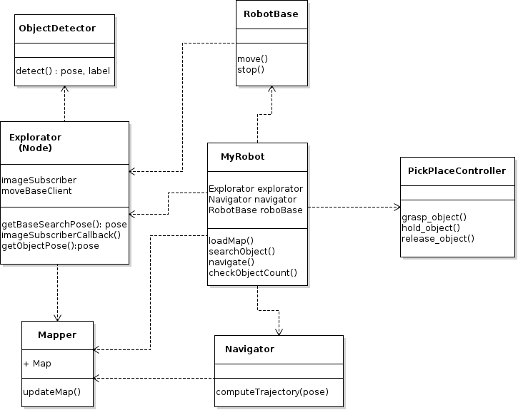
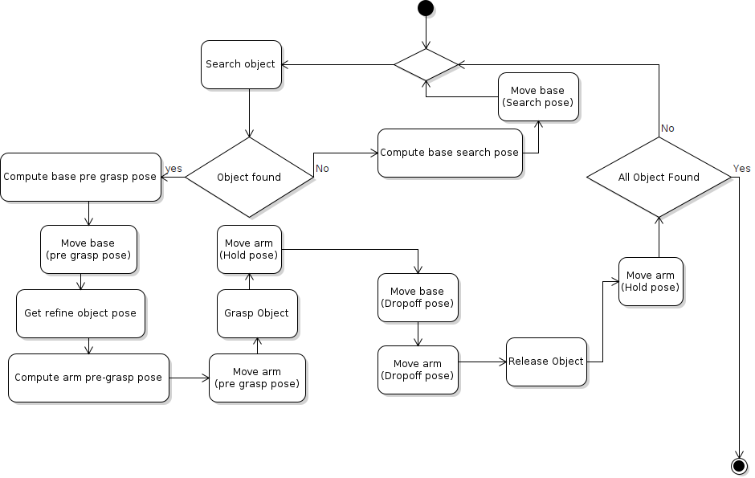

# Irona (ENPM808X: Final Project)

## Authors

**Design Keeper:** Yashveer Jain 

**Navigator:** Tharun V. Puthanveettil 

**Driver:** Pavan Mantripragada

## Overview
House with kids is fun but often messy. What if we change that for you? Your kids can have
all the fun they want without bothering you to clean up their mess. 'Irona' our robot maid
will clear your floor after your kids have finished playing with their toys. All you have to do
is place the robot in the room you wish to clean, hit start, and just wait. Irona will scan the
room floor to detect toys lying around, pick them up, and collect them in a bin.

## UML Class Diagram 

## UML Activity Diagram 

## Dependencies
* Install OpenCV version = 4.2
* ROS Noetic
* Moveit

## Product Backlog
Click [here](https://docs.google.com/spreadsheets/d/1pMMDSweZWHyVE6unGnJGsqK0Os3B_QaF1Y-Y41Slw4U/edit#gid=1860513107)

## Sprint 1 Planning
Click [here](https://docs.google.com/document/d/1MG7ZhsyHwAqyr5Dzbutqp6QzPwembGRAFyxqRqyhjJ4/edit?usp=sharing) to find sprint 1 planning
