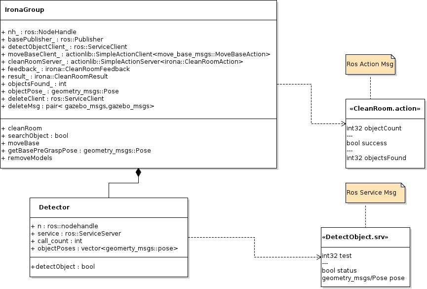

# Irona (ENPM808X: Final Project)

[](https://opensource.org/licenses/MIT)
[](https://github.com/PavanMantripragada/irona/actions/workflows/github_CI.yml)
[](https://coveralls.io/github/PavanMantripragada/irona)

## Authors

**Design Keeper:** Yashveer Jain 

**Navigator:** Tharun V. Puthanveettil 

**Driver:** Pavan Mantripragada

## Overview
House with kids is fun but often messy. What if we change that for you? Your kids can have
all the fun they want without bothering you to clean up their mess. 'Irona' our robot maid
will clear your floor after your kids have finished playing with their toys. All you have to do
is place the robot in the room you wish to clean, hit start, and just wait. Irona will scan the
room floor to detect toys lying around, pick them up, and collect them in a bin.

## UML Class Diagram 



## UML Activity Diagram 


## Dependencies
* Install OpenCV version = 4.2
* ROS Noetic
* Moveit
* Movebase

### Dependencies Install Instructions
```
sudo apt install ros-noetic-ros-control* ros-noetic-control* ros-noetic-moveit*
sudo apt install ros-noetic-ros-controllers ros-noetic-gazebo* ros-noetic-industrial-core
sudo apt install ros-noetic-dynamixel-sdk ros-noetic-dynamixel-workbench* 
sudo apt install ros-noetic-robotis-manipulator
sudo apt install ros-noetic-turtlebot3-msgs ros-noetic-turtlebot3
sudo apt install ros-noetic-vision-msgs
```
```
sudo apt install ros-noetic-laser-proc ros-noetic-rgbd-launch ros-noetic-map-server \
  ros-noetic-move-base ros-noetic-urdf ros-noetic-xacro \
  ros-noetic-compressed-image-transport ros-noetic-rqt* ros-noetic-rviz \
  ros-noetic-gmapping ros-noetic-navigation ros-noetic-interactive-markers
```
```
cd <path to catkin workspace>/src/
git clone -b noetic-devel https://github.com/ROBOTIS-GIT/open_manipulator.git
git clone -b noetic-devel https://github.com/ROBOTIS-GIT/open_manipulator_msgs.git
git clone -b noetic-devel https://github.com/ROBOTIS-GIT/open_manipulator_simulations.git
git clone https://github.com/ROBOTIS-GIT/open_manipulator_dependencies.git
git clone https://github.com/ROBOTIS-GIT/turtlebot3_manipulation.git
git clone https://github.com/ROBOTIS-GIT/turtlebot3_manipulation_simulations.git
git clone https://github.com/ROBOTIS-GIT/open_manipulator_dependencies.git
git clone -b noetic-devel https://github.com/UbiquityRobotics/fiducials.git
git clone https://github.com/mikeferguson/code_coverage.git
catkin_make
source devel/setup.bash
sudo apt install python3-coverage
```

## Instructions to build
```
cd <path to catkin workspace>/src/
git clone https://github.com/PavanMantripragada/irona.git
cd ..
catkin_make
source devel/setup.bash
```

## Auxilary Information for Developers
### Formating the code
```
cd <path to repository>/irona
clang-format -style=Google -i ./src/detectmain.cpp ./src/detectobject.cpp ./src/ironagroup.cpp ./src/ironamain.cpp ./include/irona/detector.hpp ./include/irona/ironagroup.hpp
```
### Running cppcheck
```
cd <path to repository>/turtlebot_walker
cppcheck --enable=all --std=c++11 -I include/ --suppress=missingInclude $( find . -name \*.hpp -or -name *.cpp | grep -vE -e "^./build/" -e "^./vendor/")
```

### Running cpplint
```
cd <path to repository>/turtlebot_walker
cpplint --filter=-build/c++11,+build/c++17,-build/namespaces,-build/include_order $( find . -name \*.hpp -or -name \*.cpp | grep -vE -e "^./build/" -e "^./vendor/" )
```
### Generating Documentation
```
cd <path to repository>/docs
doxygen Doxyfile
```

## Product Backlog
Click [here](https://docs.google.com/spreadsheets/d/1pMMDSweZWHyVE6unGnJGsqK0Os3B_QaF1Y-Y41Slw4U/edit#gid=1860513107)

## Sprint 1 Planning
Click [here](https://docs.google.com/document/d/1MG7ZhsyHwAqyr5Dzbutqp6QzPwembGRAFyxqRqyhjJ4/edit?usp=sharing) to find sprint 1 planning

## Sprint 1 Review
Click [here](https://docs.google.com/document/d/1Wv_h7vQbm0EJ9wbs9j15DGXhomWc1nVK1MhX5FHFCqk/edit?usp=sharing) to find sprint 1 review

## Sprint 2 Planning
Click [here](https://docs.google.com/document/d/1rXcNMr6ZjOhD-h_HUnBRr6CosEsc15x_xSZAXKRUjnw/edit?usp=sharing) to find sprint 2 planning

## Sprint 2 Review
Click [here](https://docs.google.com/document/d/1vL9f8UbFCyEK2pT7uqZMs_aatZJEmN-XreymB_0AEf8/edit?usp=sharing) to find sprint 2 review